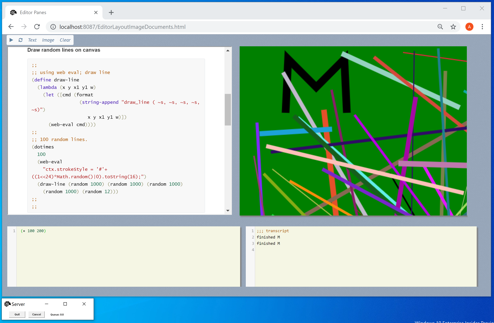

# scheme-web-view-service
**A web view for scheme** 

Composed from  Chez Scheme and a local web service

-------

*Selfie* 

*This requires windows 10*

**Reason**

I prefer a workspace type interface rather than a terminal interface.

I like panes rather than overlapping windows; you can adjust these panes a little; there is an invisible splitter between them; you can drag that.

Usage

- Type in your scheme code; press control-return; the result is displayed below.
- Pressing shift-return will run a selected bit of code; I use that a lot.

If you write a function that uses display; that output goes into the wider transcript pane.

Although the text tiles are editable (thanks to code mirror) this is not an editor; visual studio code is a great modern editor for editing scheme and C++ code.

As well as executing scheme functions in the service from the browser based view; you can also have the scheme functions evaluate any JavaScript ; so that makes for reasonably unlimited potential.

The web server provides a server event stream based communications channel; so that  scheme can send messages to the browser directly.

The image view example; provides a canvas pane for drawing 2d graphics.

The documentation pane; includes scheme scripts that can be selected and evaluated directly.

**Limitations**

I am using the single threaded version of scheme so it only ever runs one thing at a time. 

Some features of Chez Scheme are deeply linked into the core of its terminal loving nature; and very hard to use outside of it; I have tried to redirect the traffic; but not intrusively.  I do not modify Chez Scheme at all.

##### Other documentation

There is a Wiki here with notes; documentation is in the app.

#### Building

- I use a modern version of windows 10; and a Visual Studio.
- I use a web server that is a header only library; and some components that can be obtained using vcpkg; a C++ package manager.
- Will add a more detailed build guide later.

------

Chez Scheme

https://github.com/cisco/ChezScheme

---

I also have a version of this application that use and embedded Windows 10 control. 